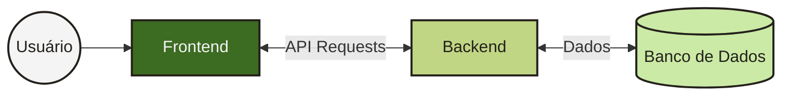
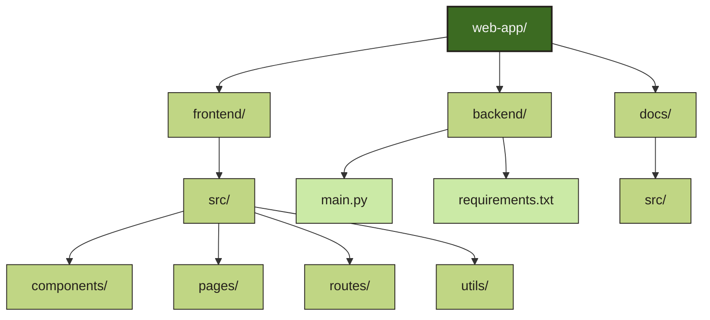
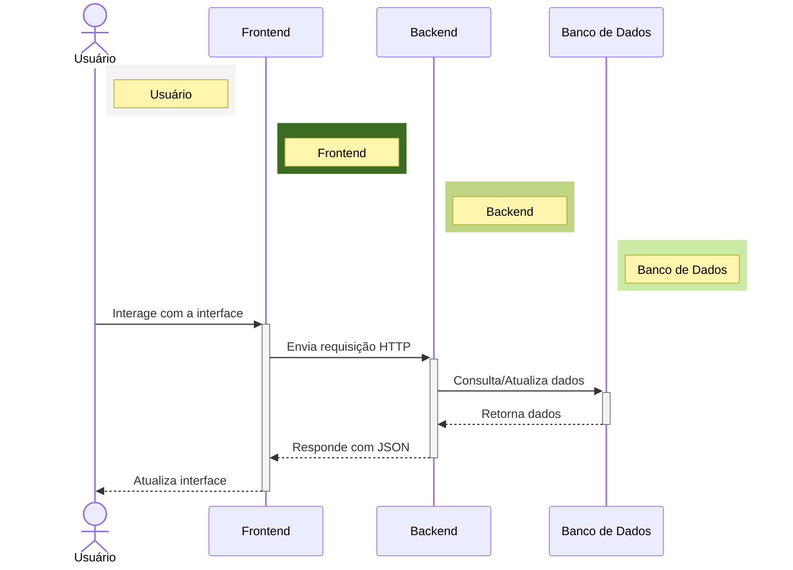
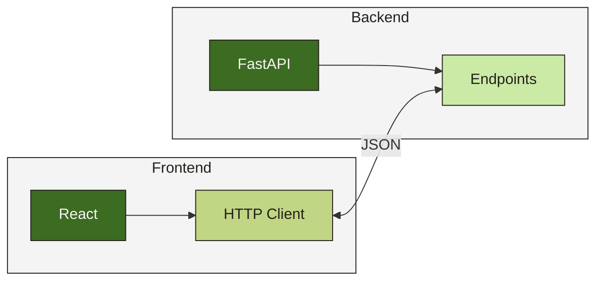

# Arquitetura do Projeto

Este projeto segue uma arquitetura moderna de aplicação web, com separação clara entre frontend e backend. Esta abordagem permite o desenvolvimento independente de cada parte, facilitando a manutenção e escalabilidade.

## Visão Geral

## Estrutura de Diretórios

O projeto está organizado nos seguintes diretórios principais:

## Tecnologias Utilizadas

### Backend

- **FastAPI**: Framework moderno para construção de APIs com Python
- **Pydantic**: Validação de dados e configurações
- **CORS Middleware**: Para permitir requisições do frontend

### Frontend

- **React**: Biblioteca JavaScript para construção de interfaces
- **TypeScript**: Superset tipado de JavaScript
- **TanStack Router**: Gerenciamento de rotas
- **Tailwind CSS**: Framework CSS utilitário
- **Radix UI**: Componentes acessíveis e sem estilo
- **Rspack**: Bundler de alta performance

## Fluxo de Dados

## Comunicação entre Frontend e Backend

A comunicação entre o frontend e o backend é realizada através de requisições HTTP. O backend expõe endpoints REST que o frontend consome.

Esta arquitetura permite que o frontend e o backend sejam desenvolvidos e implantados independentemente, facilitando a manutenção e a escalabilidade do projeto.
