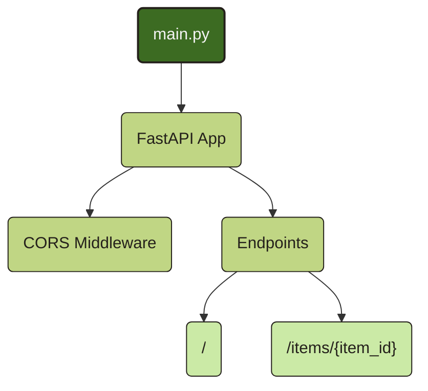
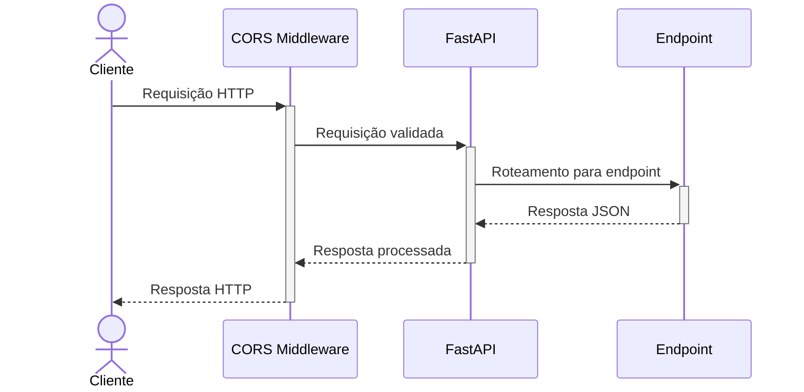
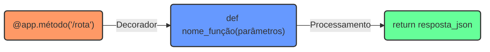

# Backend

O backend deste projeto é construído com FastAPI, um framework moderno e de alto desempenho para construção de APIs com Python.

## Tecnologias Principais

- **FastAPI**: Framework web assíncrono para Python
- **Pydantic**: Validação de dados e configurações
- **CORS Middleware**: Para permitir requisições cross-origin do frontend

## Estrutura do Backend



## Endpoints da API

Atualmente, a API possui os seguintes endpoints:

### Endpoint Raiz (`/`)

```python
@app.get("/")
def read_root():
    return {"Hello": "World"}
```

Este endpoint retorna uma simples mensagem de boas-vindas.

### Endpoint de Itens (`/items/{item_id}`)

```python
@app.get("/items/{item_id}")
def read_item(item_id: int, q: Union[str, None] = None):
    return {"item_id": item_id, "q": q}
```

Este endpoint aceita um ID de item como parte da URL e um parâmetro de consulta opcional `q`.

## Fluxo de Requisição



## Configuração CORS

O backend está configurado para aceitar requisições do frontend que está rodando em `http://localhost:3000`:

```python
app.add_middleware(
    CORSMiddleware,
    allow_origins=["http://localhost:3000"],  # ou ["*"] para desenvolvimento
    allow_credentials=True,
    allow_methods=["*"],
    allow_headers=["*"],
)
```

## Expansão da API

Para adicionar novos endpoints à API, siga o padrão de decoradores do FastAPI:



Onde:

- `método` pode ser `get`, `post`, `put`, `delete`, etc.
- `/rota` é o caminho do endpoint
- `parâmetros` são os parâmetros da função, que podem vir da URL, query, body, etc.

## Execução do Backend

Para executar o backend localmente, você precisa ter o Python instalado e as dependências listadas em `requirements.txt`. Execute:

```bash
pip install -r requirements.txt
uvicorn main:app --reload
```

O servidor estará disponível em `http://localhost:8000` por padrão.
