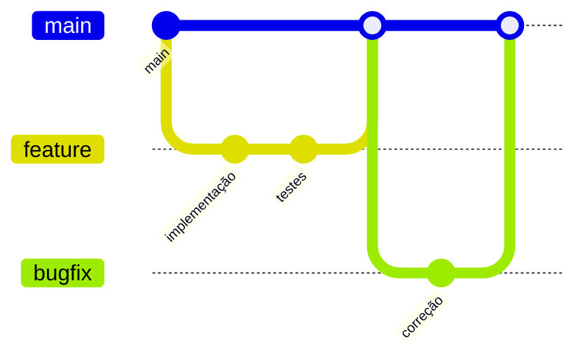
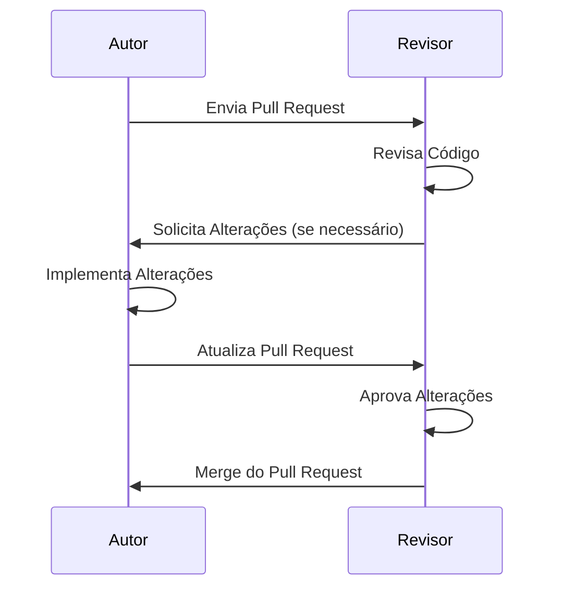

# Contribuição

Este documento fornece diretrizes para contribuir com o projeto. Agradecemos seu interesse em melhorar esta aplicação!

## Fluxo de Contribuição

```mermaid
flowchart LR
    A[Fork do Repositório] --> B[Criar Branch]
    B --> C[Implementar Mudanças]
    C --> D[Executar Testes]
    D --> E[Enviar Pull Request]
    E --> F{Code Review}
    F -->|Aprovado| G[Merge]
    F -->|Alterações Necessárias| C

    %% Aplicando a nova paleta de cores
    %% Cores: fern-green (#3c6b22), eerie-black (#24201b), white (#f4f4f4), tea-green (#cbeaa6), pistachio (#c0d684)

    classDef start fill:#3c6b22,stroke:#24201b,stroke-width:2px,color:#f4f4f4;
    classDef process fill:#c0d684,stroke:#24201b,stroke-width:1px,color:#24201b;
    classDef decision fill:#cbeaa6,stroke:#24201b,stroke-width:1px,color:#24201b;
    classDef end fill:#3c6b22,stroke:#24201b,stroke-width:2px,color:#f4f4f4;

    class A start;
    class B,C,D,E process;
    class F decision;
    class G end;
```

## Ambiente de Desenvolvimento

### Configuração Inicial

1. Faça um fork do repositório
2. Clone seu fork localmente:
   ```bash
   git clone https://github.com/seu-usuario/web-app.git
   cd web-app
   ```
3. Configure os remotes:
   ```bash
   git remote add upstream https://github.com/repositorio-original/web-app.git
   ```

### Branches



<style>
  /* Customização das cores do gitGraph */
  .mermaid .commit-id,
  .mermaid .commit-msg,
  .mermaid .branch {
    fill: #24201b !important;
  }
  .mermaid .branch-label {
    fill: #24201b !important;
  }
  .mermaid .commit {
    fill: #3c6b22 !important;
  }
  .mermaid .arrow {
    stroke: #c0d684 !important;
  }
</style>

Siga estas convenções para nomes de branches:

- `feature/nome-da-feature` - Para novas funcionalidades
- `bugfix/nome-do-bug` - Para correções de bugs
- `docs/nome-da-documentacao` - Para atualizações na documentação
- `refactor/nome-do-refactor` - Para refatorações de código

## Padrões de Código

### Backend (Python)

- Siga o PEP 8 para estilo de código
- Utilize tipagem estática quando possível
- Documente funções e classes com docstrings
- Escreva testes unitários para novas funcionalidades

### Frontend (TypeScript/React)

- Siga o estilo de código definido pelo ESLint/Prettier
- Componentes devem ser funcionais e utilizar hooks
- Utilize tipagem estática com TypeScript
- Mantenha componentes pequenos e com responsabilidade única

## Processo de Pull Request

1. Certifique-se de que seu código segue os padrões do projeto
2. Atualize a documentação conforme necessário
3. Inclua testes para novas funcionalidades
4. Faça o rebase da sua branch com a main antes de enviar o PR
5. Descreva claramente as mudanças no PR

## Revisão de Código



## Relatando Bugs

Ao relatar bugs, inclua:

1. Descrição clara do problema
2. Passos para reproduzir
3. Comportamento esperado vs. comportamento atual
4. Screenshots (se aplicável)
5. Informações do ambiente (navegador, sistema operacional)

## Propondo Melhorias

Para propor melhorias:

1. Descreva claramente a melhoria
2. Explique por que essa melhoria é útil
3. Forneça exemplos de como a melhoria funcionaria
4. Se possível, inclua mockups ou diagramas

## Comunicação

Utilize os canais apropriados para comunicação:

- **Issues do GitHub**: Para bugs e solicitações de recursos
- **Pull Requests**: Para contribuições de código
- **Discussões**: Para perguntas e debates sobre o projeto

Agradecemos sua contribuição para tornar este projeto melhor!
