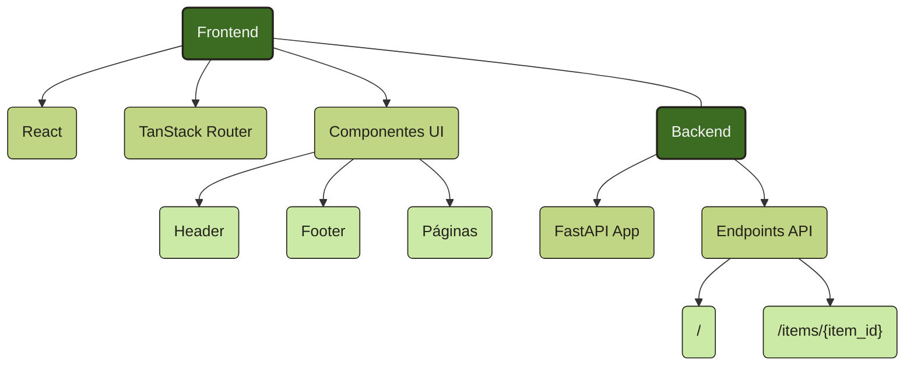

# Diagrama do Projeto

Esta seção apresenta uma visão geral visual da estrutura do projeto Ia no Lab, mostrando como os diferentes componentes se relacionam.

## Diagrama Geral

Este diagrama ilustra a estrutura principal do projeto, mostrando a separação entre o frontend e o backend, bem como os principais componentes de cada parte do sistema.
