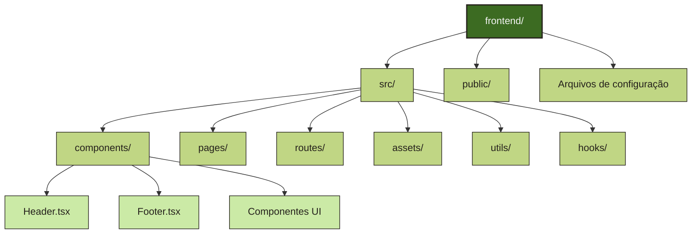
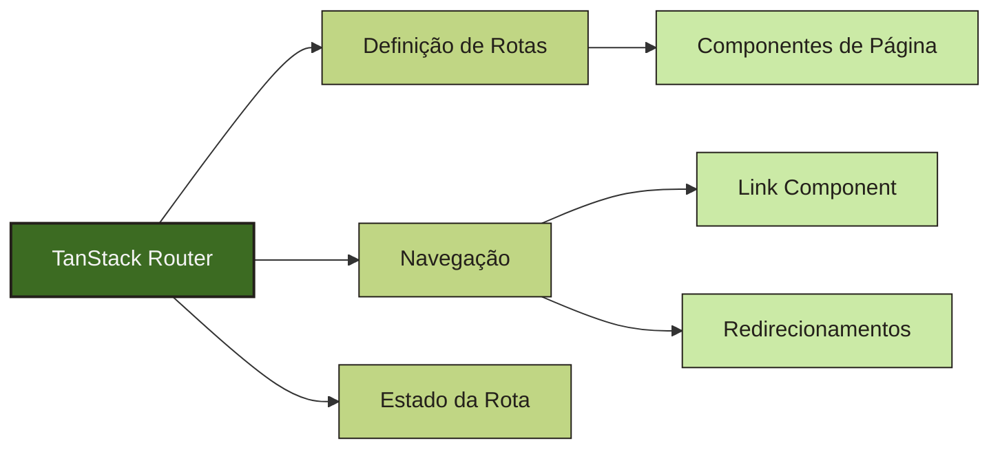
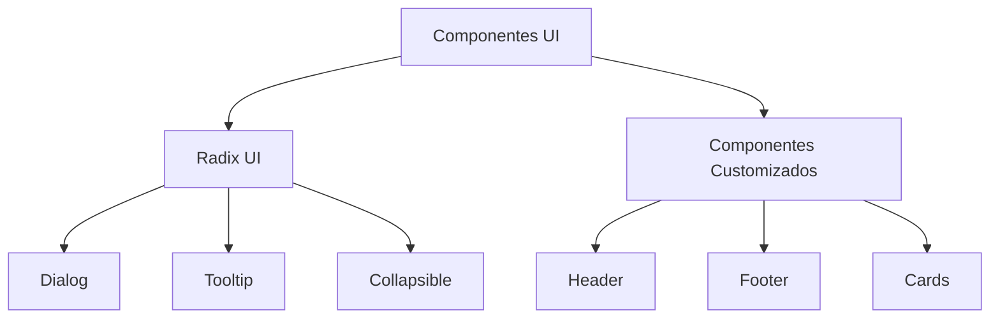
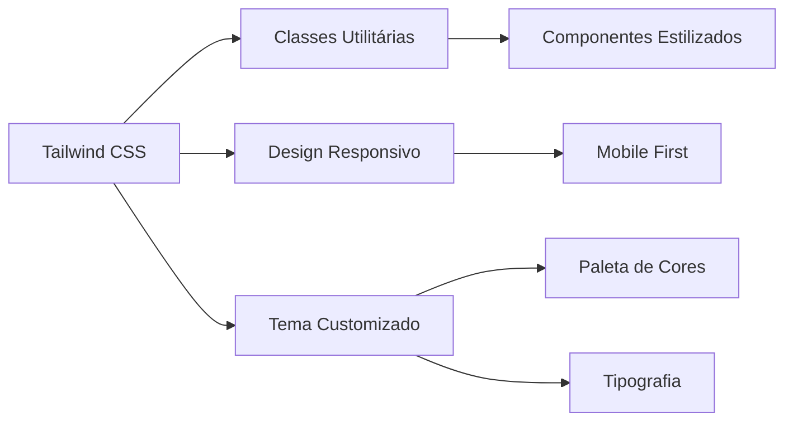

# Frontend

O frontend deste projeto é desenvolvido com React e TypeScript, utilizando o Rspack como bundler para melhor performance. A aplicação segue uma arquitetura moderna de componentes e utiliza o TanStack Router para gerenciamento de rotas.

## Tecnologias Principais

```mermaid
mindmap
  root((Frontend))
    React 19
      Hooks
      Componentes
    TypeScript
    TanStack Router
    Tailwind CSS
    Radix UI
      Componentes acessíveis
    Rspack
      Bundler de alta performance

  %% Aplicando a nova paleta de cores
  %% Cores: fern-green (#3c6b22), eerie-black (#24201b), white (#f4f4f4), tea-green (#cbeaa6), pistachio (#c0d684)

  style root fill:#3c6b22,stroke:#24201b,stroke-width:2px,color:#f4f4f4
```

## Estrutura de Diretórios



## Componentes Principais

### App.tsx

O componente `App.tsx` é o componente raiz da aplicação, responsável por renderizar o layout básico e gerenciar a exibição condicional de componentes como Header e Footer:

```tsx
function App() {
  const route = useRouterState({ select: (s) => s.location.pathname });

  const isDashboard = route.startsWith("/home");

  return (
    <div className="min-h-screen flex flex-col">
      <nav>{!isDashboard && <Header />}</nav>
      <main className="flex-1">
        <Outlet />
      </main>
      {!isDashboard && <Footer />}
    </div>
  );
}
```

## Sistema de Roteamento

O projeto utiliza o TanStack Router para gerenciamento de rotas. Este sistema permite uma navegação eficiente entre as diferentes páginas da aplicação.



## Fluxo de Renderização

```mermaid
sequenceDiagram
    participant U as Usuário
    participant R as Router
    participant A as App.tsx
    participant C as Componentes
    participant P as Página Atual

    U->>R: Navega para URL
    R->>A: Determina rota ativa
    A->>A: Verifica se é dashboard
    A->>C: Renderiza Header/Footer (condicional)
    A->>P: Renderiza página via Outlet
    P->>U: Exibe conteúdo

    %% Aplicando a nova paleta de cores
    %% Cores: fern-green (#3c6b22), eerie-black (#24201b), white (#f4f4f4), tea-green (#cbeaa6), pistachio (#c0d684)

    style U fill:#f4f4f4,stroke:#24201b,stroke-width:2px,color:#24201b
    style R fill:#3c6b22,stroke:#24201b,stroke-width:2px,color:#f4f4f4
    style A fill:#3c6b22,stroke:#24201b,stroke-width:2px,color:#f4f4f4
    style C fill:#c0d684,stroke:#24201b,stroke-width:1px,color:#24201b
    style P fill:#cbeaa6,stroke:#24201b,stroke-width:1px,color:#24201b
```

## Componentes UI

O projeto utiliza componentes do Radix UI combinados com Tailwind CSS para criar uma interface moderna e acessível.



## Hooks Personalizados

O projeto inclui hooks personalizados para reutilização de lógica, como o `use-mobile.ts` que detecta se o dispositivo é móvel:

```typescript
// Exemplo simplificado de um hook personalizado
function useMobile() {
  const [isMobile, setIsMobile] = useState(false);

  useEffect(() => {
    // Lógica para detectar dispositivo móvel
    // ...
  }, []);

  return isMobile;
}
```

## Estilização

O projeto utiliza Tailwind CSS para estilização, permitindo um desenvolvimento rápido e consistente da interface:



## Execução do Frontend

Para executar o frontend localmente, você precisa ter o Node.js instalado. Execute:

```bash
pnpm install
pnpm dev
```

O servidor de desenvolvimento estará disponível em `http://localhost:3000` por padrão.
