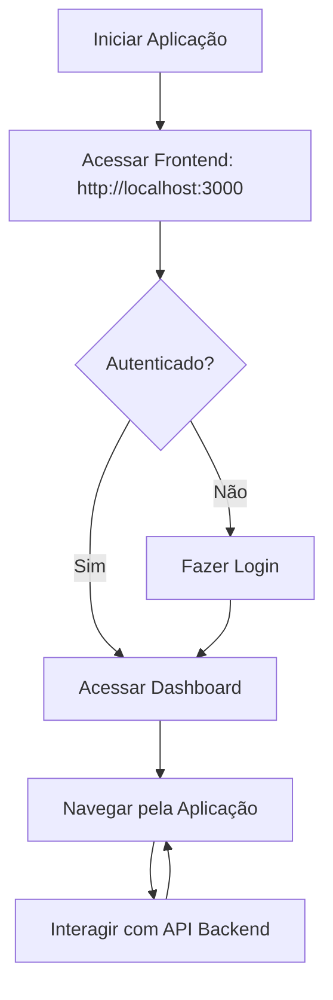
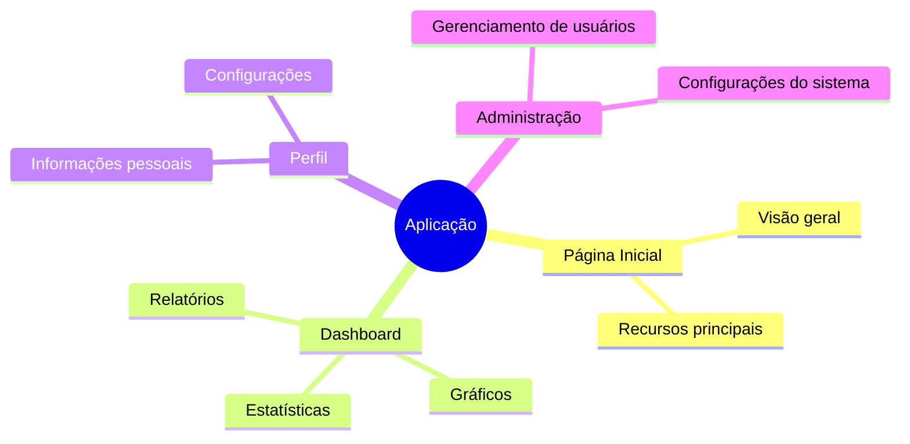

# Guia de Uso

Este guia fornece instruções detalhadas sobre como configurar, instalar e utilizar a aplicação web.

## Requisitos

Antes de começar, certifique-se de ter instalado:

- **Node.js** (v18 ou superior)
- **Python** (v3.9 ou superior)
- **pnpm** (para gerenciamento de pacotes do frontend)
- **pip** (para gerenciamento de pacotes do backend)

## Instalação

### Configuração do Backend

```bash
cd backend
pip install -r requirements.txt
```

### Configuração do Frontend

```bash
cd frontend
pnpm install
```

## Execução da Aplicação

### Iniciando o Backend

```bash
cd backend
uvicorn main:app --reload
```

O servidor backend estará disponível em `http://localhost:8000`.

### Iniciando o Frontend

```bash
cd frontend
pnpm dev
```

A aplicação frontend estará disponível em `http://localhost:3000`.

## Fluxo de Uso



## Funcionalidades Principais

### Navegação

A aplicação possui as seguintes áreas principais:



## Solução de Problemas

### Problemas Comuns

| Problema                         | Possível Solução                                                              |
| -------------------------------- | ----------------------------------------------------------------------------- |
| Frontend não conecta ao backend  | Verifique se o backend está rodando e se as configurações CORS estão corretas |
| Erro de dependências no frontend | Execute `pnpm install` novamente para reinstalar as dependências              |
| Backend retorna erro 500         | Verifique os logs do servidor para identificar o problema                     |
| Página não carrega corretamente  | Limpe o cache do navegador e tente novamente                                  |

### Logs

Para problemas mais complexos, verifique os logs:

- **Backend**: Logs são exibidos no terminal onde o servidor está rodando
- **Frontend**: Abra o console do navegador (F12) para ver mensagens de erro

## Atualizações

Para atualizar a aplicação para a versão mais recente:

1. Faça pull das últimas alterações do repositório
2. Atualize as dependências do backend: `pip install -r requirements.txt`
3. Atualize as dependências do frontend: `pnpm install`
4. Reinicie os servidores backend e frontend
