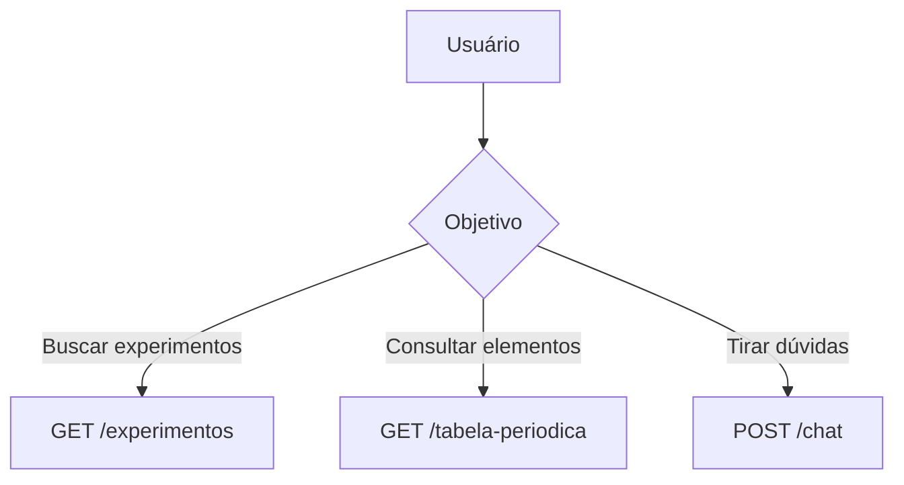

# Documentação da API - Plataforma de Educação Científica

## Guia Rápido



## Primeiros Passos

### Exemplo 1: Professor criando experimento

```http
POST /experimentos
{
  "nome": "Eletrólise da Água",
  "itens": ["fonte 9V", "água destilada", "eletrodos"]
}
```

### Exemplo 2: Aluno consultando elemento

```http
GET /tabela-periodica/elementos/simbolo/O
```

## Fluxos Principais

### 1. Gerenciar Experimentos

- Listar todos ➔ GET /experimentos
- Detalhar experimento ➔ GET /experimentos/{id}
- Criar novo ➔ POST /experimentos

### 2. Consultar Tabela Periódica

- Buscar por símbolo ➔ GET /tabela-periodica/elementos/simbolo/{simbolo}
- Listar completa ➔ GET /tabela-periodica/elementos

### 3. Chat Científico

- Enviar mensagem ➔ POST /chat
- Histórico ➔ GET /chat/historico/{id_usuario}

## Endpoints

### Experimentos

#### Listar Todos os Experimentos

```http
GET /experiments
```

Retorna uma lista de todos os experimentos disponíveis.

#### Obter Experimento por ID

```http
GET /experiments/{experiment_id}
```

Retorna os detalhes de um experimento específico.

#### Criar Novo Experimento

```http
POST /experiments
```

Cria um novo experimento no sistema.

**Corpo da Requisição:**

```json
{
  "name": "string",
  "description": "string",
  "items": ["string"]
}
```

#### Recomendar Experimentos

```http
POST /experiments/recommend
```

Recomenda experimentos com base nos itens disponíveis.

**Corpo da Requisição:**

```json
{
  "items": ["string"]
}
```

### Tabela Periódica

#### Listar Todos os Elementos

```http
GET /periodic-table/elements
```

Retorna uma lista de todos os elementos da tabela periódica.

#### Obter Elemento por Número Atômico

```http
GET /periodic-table/elements/{atomic_number}
```

Retorna detalhes de um elemento específico.

#### Obter Elemento por Símbolo

```http
GET /periodic-table/elements/symbol/{symbol}
```

Retorna detalhes de um elemento pelo seu símbolo químico.

### Chat Interativo

#### Enviar Mensagem

```http
POST /v1/chat
```

**Descrição:**
Processa mensagens do usuário e retorna respostas contextualizadas

**Parâmetros:**

```json
{
  "user_id": "string (obrigatório)",
  "message": "string (obrigatório)",
  "context": "string (opcional)"
}
```

**Resposta de Sucesso:**

```json
{
  "message_id": "string",
  "timestamp": "datetime",
  "response": "string",
  "sources": ["string"]
}
```

**Códigos de Erro:**

- 400: Parâmetros inválidos
- 401: Não autenticado
- 500: Erro no processamento

#### Histórico de Conversas

```http
GET /v1/chat/history/{user_id}
```

**Descrição:**
Recupera o histórico completo de interações do usuário

**Exemplo de Resposta:**

```json
[
  {
    "date": "2024-03-15",
    "interactions": [
      {
        "question": "string",
        "answer": "string",
        "timestamp": "datetime"
      }
    ]
  }
]
```

**Parâmetros:**

- `user_id` (path): ID único do usuário

**Códigos de Erro:**

- 404: Usuário não encontrado

## Códigos de Status

- 200: Sucesso
- 400: Requisição inválida
- 404: Recurso não encontrado
- 500: Erro interno do servidor

## Solução de Problemas Comuns

### ❌ Erro 401: Acesso não autorizado

👉 **Solução:** Verifique se incluiu o token de autenticação no cabeçalho da requisição
🔍 Exemplo correto:

```http
GET /experimentos
Authorization: Bearer seu_token_aqui
```

### 🔎 Elemento não encontrado

👉 **Causas comuns:**

- Símbolo químico escrito em minúsculas (ex: usar 'fe' ao invés de 'Fe')
- Espaços extras no parâmetro
  ✅ **Solução correta:**

```http
GET /tabela-periodica/elementos/simbolo/Na
```

### 🧪 Experimentos sem resultados

🔧 **Dica:** Use termos mais genéricos na pesquisa
📝 Exemplo eficaz:

```json
{
  "itens": ["vidro", "bicarbonato"]
}
```

## Glossário de Termos Técnicos

| Termo           | Exemplo Prático                            | Explicação Leiga                           |
| --------------- | ------------------------------------------ | ------------------------------------------ |
| **Endpoint**    | `GET /experimentos`                        | "Endereço" para acessar uma funcionalidade |
| **Payload**     | Dados enviados no corpo da requisição POST | "Envelope" com informações para o servidor |
| **HTTP 200**    | Resposta de sucesso                        | "Tudo certo, operação concluída!"          |
| **Query Param** | `?elemento=Ouro`                           | Filtro de pesquisa na URL                  |

## Exemplo Completo: Fluxo de Chat

**Cenário:** Aluna perguntando sobre tabela periódica

```http
POST /v1/chat
{
  "user_id": "aluna_maria",
  "message": "Qual elemento tem 79 prótons?"
}
```

**Resposta Esperada:**

```json
{
  "response": "O elemento com 79 prótons é o Ouro (Au)! ✨",
  "sources": ["Tabela Periódica Digital da IUPAC"]
}
```
